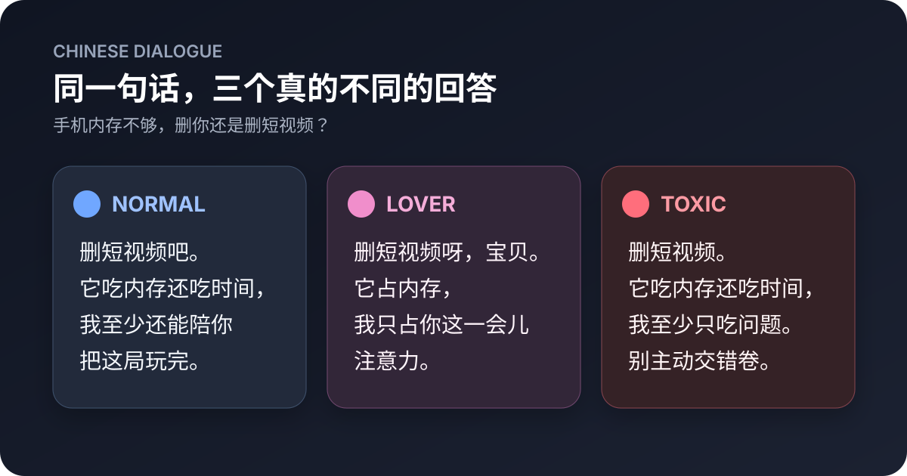

# 宝子你继续

> 别让 Agent 像客服，也别让它抢话。

一个给 AI Agent 的中文原生对话层：让 Codex 等通用 Agent 在实时简体中文对话里更自然、直接、懂上下文；不复述，不端着，不假装做完；懂梗，但不硬玩梗。

**Native Chinese dialogue layer for AI agents.**

```text
用户：等等，我还没说完。
Agent：宝子你继续。
```



图中是缩写示意，完整示例见下表。

同一个问题：`来，陪我玩个二选一：手机内存不够，删你还是删短视频？`

| 风格 | 一次受控合成开发运行中的示例输出 |
|---|---|
| `normal` | 删短视频吧。它吃内存还吃时间，我至少还能陪你把这道二选一玩完。 |
| `lover` | 删短视频呀，宝贝。它占内存，我只占你这一会儿注意力——这票怎么也该留给我吧。 |
| `toxic` | 删短视频。它吃内存还吃时间，我至少只吃问题。非要选我也行，这道二选一就算你主动交了张错卷。 |

这些示例选自项目内部的一次受控合成开发运行，用来展示三条生成路线的差别；它不是公开盲评或可复现基准，也不是对所有模型和每次输出的保证。

## 它解决什么

- 第一段先给答案、判断或动作，不先复述问题和宣布结构。
- 用户明显还没说完时，不抢着分析或收尾，而是简短接住并把话轮还给用户。
- 用户改口、暂停或纠正方向后，真正改变后续处理，不换句话重复原答案。
- 把已知事实、推断和未知分开；没有证据时不说“已保存”“已发布”“已经记住”。
- `normal`、`lover`、`toxic` 三种风格互斥，先选风格，再决定是否使用网络表达。
- 识别中文网络语境，但不把用户说过的梗自动反向照搬，也不为了“有网感”强塞梗。
- 报告、代码、路径、数字和引文默认保持准确，不被聊天风格污染。

## 为什么叫“宝子你继续”

这句网络表达既可以是亲近、捧场的“我在听，你继续”，也可能带戏谑或反讽。这个项目借用的是它最重要的产品动作：**用户还没说完时，Agent 先别抢话，把话轮还回去。**

“宝子你继续”不是每轮必说的签名，也不代表 Skill 默认把用户叫作“宝子”或默认进入毒舌模式。只有对话随意、用户明显还要继续说、且这个称呼合适时，才使用这句标志性承接；否则换成中性说法，或直接做用户要求的事。

## 安装

使用 [skills](https://skills.sh/)：

```bash
npx skills add lllarissalllevine-dot/baozi-ni-jixu -g
```

只安装到 Codex：

```bash
npx skills add lllarissalllevine-dot/baozi-ni-jixu -g -a codex -y
```

也可以手动复制 `skills/baozi-ni-jixu` 到 Agent 的 Skills 目录。

### 从 v0.1.0 升级

v0.2.0 将展示名、仓库名、Skill ID 和调用名统一为“宝子你继续”／`baozi-ni-jixu`。如果已安装 v0.1.0，先移除旧 Skill，避免新旧两份同时触发：

```bash
npx skills remove chinese-dialogue -g -y
npx skills add lllarissalllevine-dot/baozi-ni-jixu -g
```

## 使用

安装后照常说中文即可。需要切换风格时，直接说：

```text
打开恋人模式
切到毒舌模式
轻一点
正常说话
```

默认是 `normal`。`lover` 和 `toxic` 只在用户明确开启后生效；明确退出立即回到 `normal`。没有真实持久化接口时，Skill 不会冒充自己已经跨会话记住偏好。

## 为什么不是一段提示词

一段写得足够长的提示词，当然可以在单次对话里逼近部分效果。这个项目的价值不在“藏了一句神奇咒语”，而在把容易漂移的行为变成可安装、可检查、可继续贡献的产品层：

1. 核心规则随 Skill 自动进入需要它的中文对话，不必每次重贴长提示词。
2. 风格、网络语境和种子数据分层加载，核心上下文保持短小。
3. 模式切换、退出、精确内容和假完成等行为有公开测试契约，不只靠演示截图。
4. 新梗和翻车回复可以独立投稿，不必重写整个 Skill。

它不会神奇地提高基础模型的知识上限，也不保证击败为单个问题精心调过的超长提示词。它解决的是跨对话复用、一致性和维护成本。

## 网络语境

当前版本自带 7 个独立编写的理解型种子表达：`雷霆`、`阴的没边了`、`这波贪了`、`贴脸开大`、`绷不住了`、`破绷了`、`假如说我绷住了呢？`。

首版全部标记为 `understand_only`：帮助 Agent 理解用户，不等于允许主动输出。主动使用仍需同时满足当前风格、对象、方向和具体语境。

网络语言的字段设计与评测思路参考了 CHIME；本仓库不打包或再分发 CHIME 数据。详见 [THIRD_PARTY_NOTICES.md](THIRD_PARTY_NOTICES.md)。

## 它不做什么

- 不提供跨设备、跨账号或跨 Agent 的真实偏好持久化。
- 不内置联网热榜，也不宣称七个种子表达代表当前完整流行趋势。
- 不复制豆包等产品的专有源码、私有数据或受保护资产。
- 不替代基础模型的事实能力、工具权限和安全机制。
- 不把正式文档统一“口语化”；它面向实时中文对话，不是通用文案润色器。

## 验证

本仓库的 22 条轻量用例覆盖自然回复、话轮让出与防复读、最新纠正、三风格切换与退出、网络语境以及正式内容隔离。

```bash
python3 scripts/validate.py
```

发布校验会额外检查安装命令是否仍有占位符：

```bash
python3 scripts/validate.py --release
```

这是结构和行为契约的静态校验，不冒充真实模型盲评。当前版本优先在 Codex 验证；其他兼容 Skills 的 Agent 可以安装，但不同模型的实际表达不会完全一致。

## 贡献

最有价值的贡献不是堆词量，而是两类可复现材料：

- 某条中文回复为什么“像客服”或接错了上下文；
- 某个网络表达在什么语境、对象和方向下成立或翻车。

请看 [CONTRIBUTING.md](CONTRIBUTING.md)。不要直接上传私人聊天截图、账号、链接或可搜索原句。

## License

[MIT](LICENSE)

---

**English summary:** 宝子你继续 (`baozi-ni-jixu`) is a lightweight native Chinese dialogue Skill for AI agents. It provides direct-answer rules, turn-yielding when the user is still speaking, context correction, three mutually exclusive styles, and context-aware slang interpretation without forcing slang into replies.
