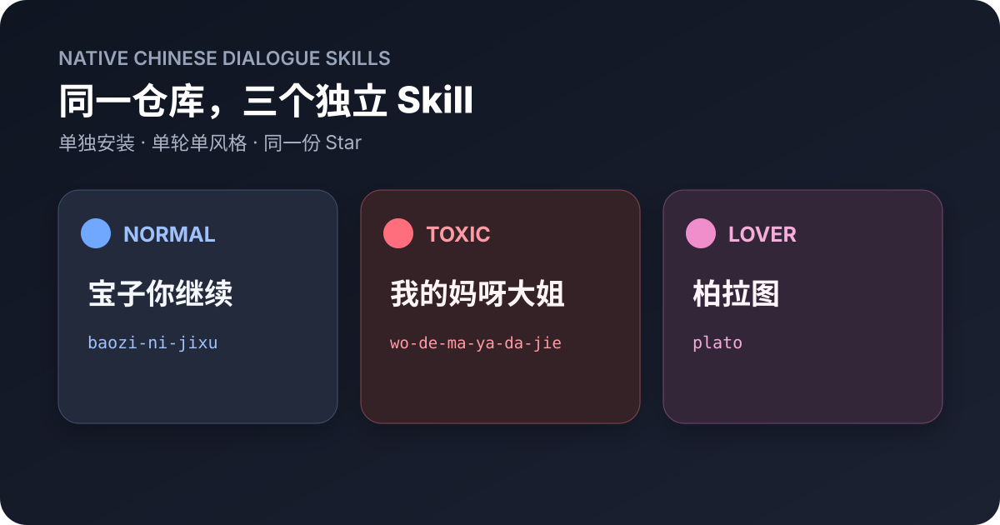

# 宝子你继续

> 别让 Agent 像客服，也别让它抢话。

一个面向 AI Agent 的中文原生对话仓库。现在包含三个可以单独安装的 Skill；它们共用网络语境底座，并通过同一套路由协议约定单轮只采用一种风格。

**Native Chinese dialogue Skills for AI agents.**

## 三个独立 Skill

### 宝子你继续

> 正常聊天时用。它会先听懂你这一轮到底要什么，该回答就回答；你还没说完时，它知道先把话轮还给你。

- Skill ID：<code>baozi-ni-jixu</code>
- 目录：<code>skills/baozi-ni-jixu</code>

### 我的妈呀大姐

> 想要毒舌、吐槽或锐评时再开。它可以说得狠，但得先说中问题，还得把你交代的正事办完。

- Skill ID：<code>wo-de-ma-ya-da-jie</code>
- 目录：<code>skills/wo-de-ma-ya-da-jie</code>

### 柏拉图

> 想要更温柔、亲近、带点恋爱感时再开。它会回应眼前的具体细节和情绪，但不会假装拥有现实关系或共同记忆。

- Skill ID：<code>plato</code>
- 目录：<code>skills/plato</code>

## 为什么拆开

旧版本把普通、毒舌和恋爱放在一个 Skill 里，安装简单，但默认触发范围太宽，也容易让普通聊天显得机械。

现在三者是同一仓库里的独立产品：

- 用户可以只安装自己需要的一个；
- 每条用户可见回复只由一个 Skill 决定表达；
- 本轮最新的明确选择优先；
- 特殊风格退出后，即使“宝子你继续”没有安装，也能回到宿主模型的中性表达；
- 看不到目标 Skill 的安装或调用状态时，不谎称已经切换成功。

平台当前没有跨 Skill 的硬互斥开关，所以本仓库用一致的路由协议和公开测试防止串线。这是行为契约，不冒充宿主层的绝对锁。

## 同一个问题，三种独立回复

用户：<code>来，陪我玩个二选一：手机内存不够，删你还是删短视频？</code>

| 当前 Skill | 示例回复 |
|---|---|
| 宝子你继续 | 删短视频。它占内存，我只占你一点注意力。 |
| 我的妈呀大姐 | 删短视频。手机内存都拉响警报了，你还在给电子瓜子争取编制？删我只能腾点空间，删短视频还能顺手抢救一下你那被上下滑切成薯片的注意力。 |
| 柏拉图 | 删短视频。它不光占内存，还偷时间；我占的那点地方，至少还能陪你做正事、陪你胡闹。  实在不够就先清缓存——别动我，听见没？ |

这些回复来自三个独立 Skill 的一次隔离前向测试。每个评测 Agent 只读取对应 Skill，再分别回答同一个问题；它们没有读取 README 或预期答案。这只是一次发布前样本，不是公开盲评，也不保证所有模型每次都输出同样的句子。

## 安装

以下命令使用 [skills CLI](https://github.com/vercel-labs/skills)。多 Skill 仓库应使用空格分隔的 <code>--skill name</code>，不要写成 <code>--skill=name</code>。

只安装“宝子你继续”：

~~~bash
npx skills add lllarissalllevine-dot/baozi-ni-jixu --skill baozi-ni-jixu -g -a codex -y
~~~

只安装“我的妈呀大姐”：

~~~bash
npx skills add lllarissalllevine-dot/baozi-ni-jixu --skill wo-de-ma-ya-da-jie -g -a codex -y
~~~

只安装“柏拉图”：

~~~bash
npx skills add lllarissalllevine-dot/baozi-ni-jixu --skill plato -g -a codex -y
~~~

三个全部安装：

~~~bash
npx skills add lllarissalllevine-dot/baozi-ni-jixu \
  --skill baozi-ni-jixu \
  --skill wo-de-ma-ya-da-jie \
  --skill plato \
  -g -a codex -y
~~~

也可以手动复制目标 Skill 目录到 Agent 的 Skills 目录。三个 Skill 都是自包含包，不依赖另一个 Skill 的相对路径。

## 使用

“宝子你继续”处理普通中文对话，也负责用户明确要求恢复正常说话的场景。

“我的妈呀大姐”和“柏拉图”只在用户明确调用、明确开启对应表达，或当前可见会话已经开启且尚未退出时生效。它们的名字被当作感叹、哲学家或引用内容时，不应误触发。

示例：

~~~text
用我的妈呀大姐吐槽这个方案
切到柏拉图
正常说话
~~~

用户同一轮无先后地要求混合两种特殊风格时，Agent 只追问要选哪个。用户明确要做效果对比时，可以输出分别标注的样例，但不代表同时开启。

## 为什么不只写一段提示词

一段足够长的提示词，可以在单次对话里逼近部分效果。本仓库解决的是重复使用和后续维护：

- 三种表达可以分别安装，不需要每轮把三套规则一起塞进上下文；
- 触发、切换、退出、误触发和精确内容保护都有公开测试；
- 网络表达与核心规则分开维护，新增一个梗不需要重写整个 Skill；
- 翻车回复可以变成回归用例，而不是下次继续碰运气。

它不会提高基础模型的知识上限，也不保证胜过为单个问题专门调过的长提示词。

## 网络语境

三个 Skill 各自携带同一份网络语境参考和七个理解型种子表达：雷霆、阴的没边了、这波贪了、贴脸开大、绷不住了、破绷了、假如说我绷住了呢？

首版种子全部是 <code>understand_only</code>：帮助理解，不等于允许主动输出。验证器会检查三个副本完全一致，避免独立安装后能力漂移。

字段设计与评测思路参考了 CHIME；本仓库不打包或再分发 CHIME 数据。详见 [THIRD_PARTY_NOTICES.md](THIRD_PARTY_NOTICES.md)。

## Token 与独立安装

Skill 的名称和技术触发说明先参与选择，只有命中的 Skill 主体才需要进入上下文。拆分后，普通对话不再同时加载毒舌和恋爱正文；网络语境参考也只在真正遇到相关表达时读取。

复制三份网络语境文件会增加少量磁盘体积，但不会让三个正文在每轮一起进入上下文。这个取舍换来每个 Skill 可以真正独立安装。

## 从旧版升级

v0.2.0 把普通、毒舌和恋爱放在同一个 <code>baozi-ni-jixu</code> Skill 中。从 v0.3.0 起，同名 Skill 只负责普通中文对话；毒舌和恋爱分别由“我的妈呀大姐”和“柏拉图”负责。

已经安装 v0.2.0 的用户，先用明确的仓库来源重新安装“宝子你继续”。这也适用于旧安装没有保存来源记录、无法使用 <code>skills update</code> 的情况：

~~~bash
npx skills add lllarissalllevine-dot/baozi-ni-jixu --skill baozi-ni-jixu -g -a codex -y
~~~

然后按需要安装另外两个 Skill。只想保留普通风格时，不需要安装它们。如果仍保留 v0.1.0 的 <code>chinese-dialogue</code>，请先移除旧 Skill，避免旧总路由和新 Skill 同时触发：

~~~bash
npx skills remove chinese-dialogue -g -y
~~~

## 验证

公开契约目前覆盖独立触发、名称误触发、双向切换、退出、缺失目标、网络语境、正式内容隔离和高风险信号。

~~~bash
python3 scripts/validate.py
~~~

发布校验还会阻止占位文案、草稿标记和无效安装信息进入正式版本：

~~~bash
python3 scripts/validate.py --release
~~~

这是结构和行为契约的静态校验，不冒充真实模型盲评。最终表达仍需隔离模型测试。

## GitHub 迭代报告

技术决策、验证结果和踩坑日志见 [docs/GITHUB-REPORT.md](docs/GITHUB-REPORT.md)。报告只记录真实发生的问题、根因和处理，不把推测写成结论。

## 贡献

最有价值的贡献是能复现的翻车回复和带语境的网络表达。请看 [CONTRIBUTING.md](CONTRIBUTING.md)，不要直接上传私人聊天截图、账号、链接或可搜索原句。

## 它不做什么

- 不提供跨设备、跨账号或跨 Agent 的真实偏好持久化。
- 不内置联网热榜，也不宣称七个种子表达代表完整流行趋势。
- 不复制豆包等产品的专有源码、私有数据或受保护资产。
- 不替代基础模型的事实能力、工具权限和安全机制。

## License

[MIT](LICENSE)

---

**English summary:** This repository contains three independently installable Simplified Chinese dialogue Skills: <code>baozi-ni-jixu</code>, <code>wo-de-ma-ya-da-jie</code>, and <code>plato</code>. Only one should control the tone of a user-visible reply at a time.
